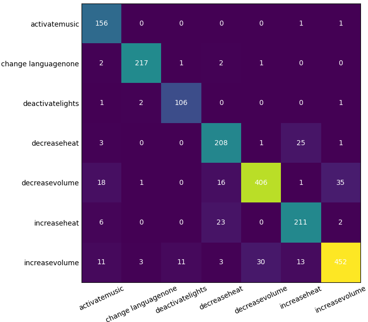

# Speech Command Recognition with CNN

## Project Overview
This project aims to build an effective Speech Command Recognition system using Convolutional Neural Networks (CNNs) to detect specific vocal commands from an audio dataset. The system is developed with a focus on recognizing seven predefined vocal commands by training on Mel-Frequency Cepstral Coefficients (MFCC) features extracted from audio signals.

## Disclaimer
This project serves as my first venture into the domain of speech command recognition and employs a straightforward approach without utilizing sophisticated methods. As such, while it achieves respectable results, it does not reach State-Of-The-Art (SOTA) outcomes. The primary intent behind this project was to gain hands-on experience and explore the basic functionalities and methodologies related to Convolutional Neural Networks and audio signal processing. Any feedback or suggestions for improvement are highly welcomed!

## Dataset
The dataset employed for this project consists of audio recordings in WAV format and is split into two parts:
- A development set containing 9854 recordings
- An evaluation set containing 1455 recordings

Each recording in the development set is accompanied by metadata including path, speaker ID, action, object, self-reported fluency level, first language, current language used for work/school, gender, and age range.

🔗 [Dataset Download Link](https://drive.google.com/file//1gUPpqPTlgfzIyDU4eG6t5HoTlK5inLO4/view?usp=sharing)

## Repository Structure
- `audio_visualization.py`: Contains functions for audio file analysis and visualization.
- `data_preprocessing.py`: Involves functions for data preprocessing, including feature extraction using MFCC.
- `model.py`: Consists of the CNN model building and training code.
- `evaluation.py`: Contains code for model evaluation, including accuracy and loss plotting and confusion matrix generation.
- `main.py`: The main executable script that runs the entire pipeline by utilizing functions from the aforementioned scripts.

## Model Architecture
The utilized CNN model leverages the power of convolutional and pooling layers to identify hierarchical patterns in the input MFCC features. After the convolutional blocks, fully connected layers are used for the classification task.

## Getting Started
### Prerequisites
- Python 3.x
- Librosa
- TensorFlow 1.x
- Keras 2.x
- NumPy
- pandas
- Matplotlib
- scikit-learn

### Usage
1. Clone the repository: git clone git@github.com:glichill/Data-Science-Lab.git
2. Navigate to the project directory and install the required packages: pip install -r requirements.txt
3. Execute the main script: python main.py

## Results
The model achieves a validation accuracy score of 89.09% after 70 epochs of training, with specific results and confusions detailed in the evaluation results.

### Confusion Matrix

The confusion matrix provides insights into the model's classification capabilities for each command category, highlighting areas where prediction improvements are needed.

## License
This project is licensed under the MIT License - see the [LICENSE.md](LICENSE.md) file for details.

## Acknowledgements
- The dataset providers for enabling this study.
- The Politecnico di Torino and the "Data Science Lab" course.

